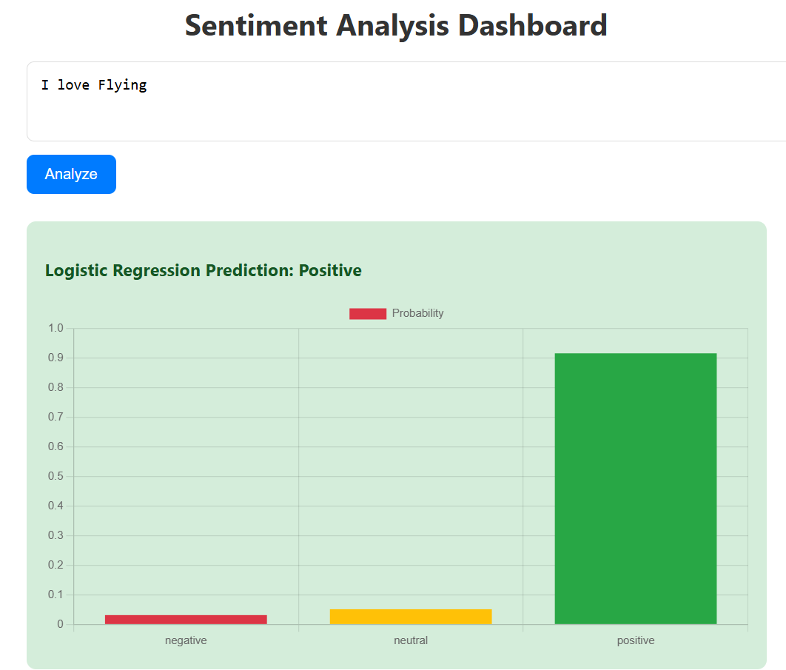
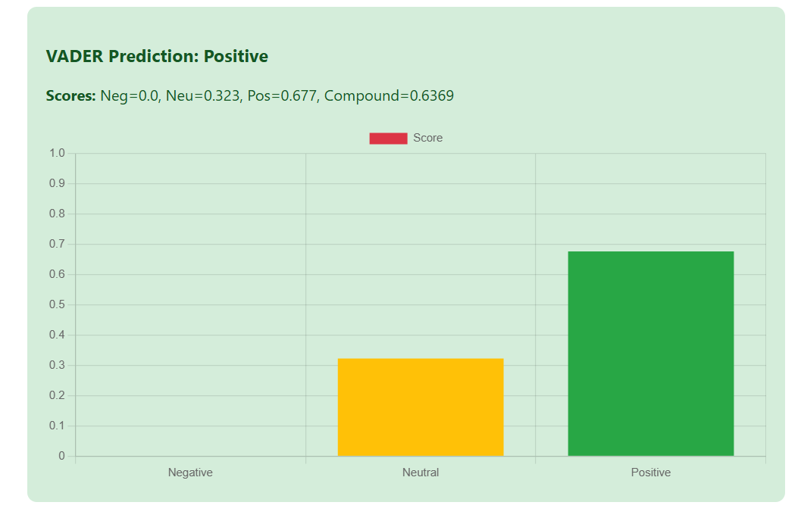

# ✈️ Twitter US Airline Sentiment Analysis  

This project performs **Sentiment Analysis** on the [Twitter US Airline Sentiment Dataset](https://www.kaggle.com/datasets/crowdflower/twitter-airline-sentiment), combining both **Machine Learning (Logistic Regression)** and **Rule-based NLP (VADER)** models.  

It includes:  
- A **Flask API** for sentiment prediction.  
- A **Web Interface** (HTML + CSS + Chart.js) to visualize predictions.  
- Comparison between **Logistic Regression** and **VADER Sentiment Analyzer**.  

---

## 🚀 Features
- **REST API** endpoint (`/predict`) to get sentiment predictions in JSON.  
- **Web Dashboard** with input box to analyze custom text.  
- Shows predictions from:
  - Logistic Regression (ML Model trained on airline tweets).  
  - VADER (Lexicon-based sentiment analyzer).  
- Displays **detailed scores/probabilities** for each model.  
- Clean, responsive UI.  

---

## 📂 Project Structure

sentiment_project/
│
├── app.py # Main Flask application
├── requirements.txt # Dependencies
├── models/ # Trained ML model + vectorizer
│ ├── log_reg_model.pkl
│ └── vectorizer.pkl
│
├── templates/ # HTML (frontend)
│ └── index.html
│
├── static/ # CSS, JS, charts
│ └── style.css
│
├── .gitignore
└── README.md

---

## Install Dependencies

pip install -r requirements.txt

---

### Then open your browser at:
 http://127.0.0.1:5000

## Output

